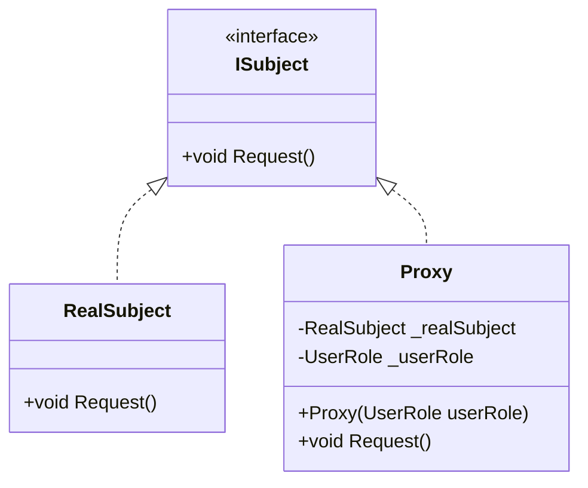

```mermaid
classDiagram

    class ISubject {
        <<interface>>
        +void Request()
    }

    class RealSubject {
        +void Request()
    }

    class Proxy {
        -RealSubject _realSubject
        -UserRole _userRole
        +Proxy(UserRole userRole)
        +void Request()
    }

    ISubject <|.. RealSubject
    ISubject <|.. Proxy
```