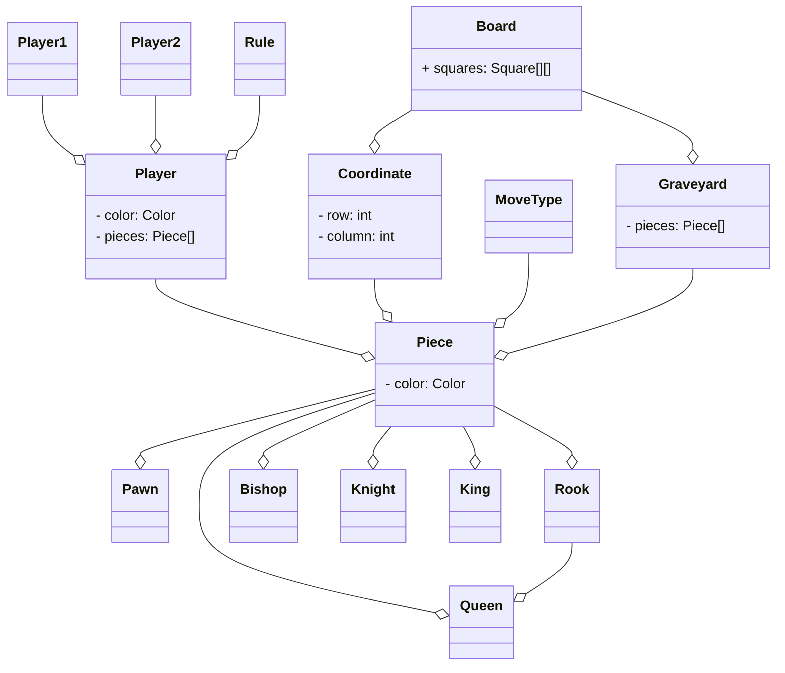

```mermaid
classDiagram
    class Player {
        - color: Color
        - pieces: Piece[]
    }

    class Player1{

    }

    class Player2{

    }

    class Rule {

    }
    
    class Board {
        + squares: Square[][]
    }

    class Coordinate {
        - row: int
        - column: int
    }

    class Graveyard {
        - pieces: Piece[]
    }

    class MoveType{

    }
    
    class Piece {
        - color: Color
    }

    class Pawn{
    }

    class Rook{
    }

    class Bishop{
    }

    class Knight{
    }

    class Queen{
    }

    class King{
    }

    Player --o Piece
    Player1 --o Player
    Player2 --o Player
    Board --o Graveyard
    Board --o Coordinate
    Coordinate --o Piece
    MoveType --o Piece
    Piece --o Rook
    Piece --o Pawn
    Piece --o Queen
    Piece --o King
    Piece --o Bishop
    Piece --o Knight
    Graveyard --o Piece
    Rule --o Player
    Rook --o Queen
```